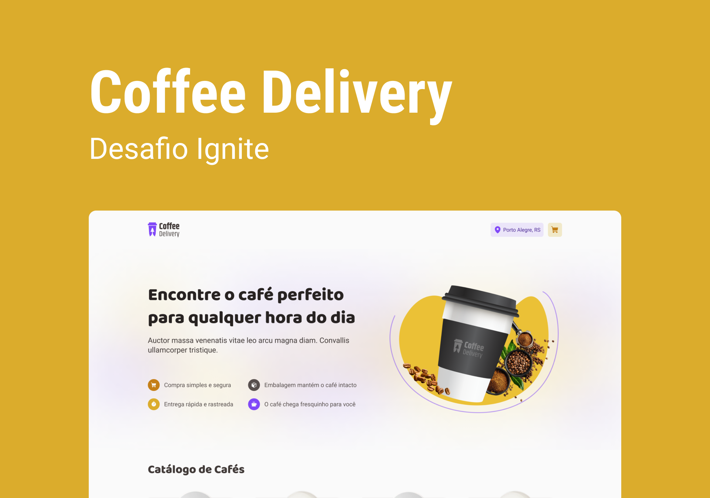

<br/>

<h4 align="center"> 
	🚧  Em construção...  🚧
</h4>

<br/>

# Coffe Delivery (Desafio Ignite)

## 🖥️ Sobre o projeto
=================

Este projeto simula uma lojinha virtual onde se realiza pedidos de café para entrega em domicilio. Com uma proposta principal de estudos, as funcionalidades se limitam ao simples gerenciamento do carrinho de compras.

Nesta aplicação web o usuário terá acesso a um catálago de cafés disponíveis para delivery e poderá realizar as seguintes ações:

* Filtrar a listagem de produtos atráves de botões
* Adicionar quantidades especificas de cada item no carrinho
* Aumentar ou dimunuir a quantidade de items do carrinho.
* Remover itens do carrinho.
* Preencher um fomulário com dados da entrega.
* Escolher o método de pagamento dentre as opções disponíveis.

## 📋 Tabela de conteúdos
=================
<!--ts-->
   * [Sobre o Projeto](##sobre-o-projeto)
   * [Tabela de Conteúdos](##tabela-de-conteudo)
   * [Tecnologias](##tecnologias)
   * [Pré-requisitos](##pre-requisitos)
   * [Como rodar a aplicação web](##como-rodar-a-aplicacao-web)
<!--te-->

## ⚒️ Tecnologias
=================

As seguintes ferrametnsa foram usadas na construção do projeto:
<ul>
  <li> <a href='https://vitejs.dev/' target='_blank'> Vite </a></li>
  <li> <a href='https://reactjs.org/' target='_blank'> React </a></li>
  <li> <a href='https://www.typescriptlang.org/' target='_blank'> Typescript </a></li>
  <li> <a href='https://styled-components.com/' target='_blank'> Styled-Components </a></li>
  <li>
    <div>
      Bibliotecas:
      <ul>
        <li>
          <a href='https://react-hook-form.com/' target='_blank'>react-hook-form</a>
        </li>
        <li>
          <a href='https://react-hook-form.com/api/useformstate/errormessage/' target='_blank'>@hookform/error-message </a>
        </li>
        <li>
          <a href='https://www.npmjs.com/package/@hookform/resolvers' target='_blank'>@hookform/resolvers </a>
        </li>
        <li>
          <a href='https://v5.reactrouter.com/web/guides/quick-start' target='_blank'>react-router-dom </a>
        </li>
        <li>
          <a href='https://phosphoricons.com/' target='_blank'>phosphor-react </a>
        </li>
        <li> 
          <a href='https://immerjs.github.io/immer/' target='_blank'>immer </a>
        </li>
        <li>
          <a href='https://github.com/colinhacks/zod' target='_blank'>zod </a>
        </li>
      </ul>
    </div>
  </li>
</ul>

## ✅ Pré-requisitos
=================

Antes de começar, você vai precisar ter instalado em sua máquina as seguintes ferramentas:
* [Git](https://git-scm.com)
* [Node.js](https://nodejs.org/en/)
* [VSCode](https://code.visualstudio.com/) (Editor sugerido)

## ⚙️ Como rodar a aplicação web
=================

```bash
# Clone este repositório
$ git clone https://github.com/jp2mesquita/coffeDelivery-Rocketseat-Challenge

#Acesse a pasta do projeto no terminal/cmd
$ cd coffeDelivery-Rocketseat-Challenge

#Instale as dependências
$ npm install

#Inicie o projeto
$ npm run dev
```

## 🧔 Autor
=================

<a href="https://blog.rocketseat.com.br/author/thiago/">
 
 <br />
Desenvolvido com 💜 por João Paulo Mesquita

<br/>

[](https://www.linkedin.com/in/jo%C3%A3o-paulo-mesquita-02a4a3179/)  [](mailto:jp-mesquita@live.com)

